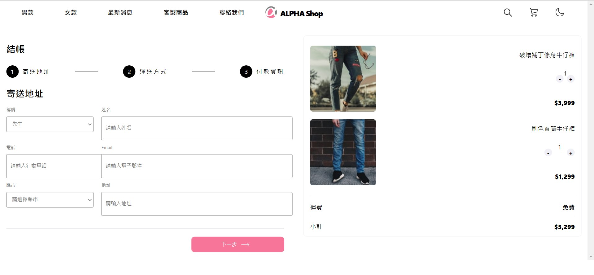

# REACT專案 ALPHA-SHOP
---

## 專案介紹
---
*此次負責的內容是ALPHA-SHOP的購物車頁面，以REACT.JS的技術完成，CSS模式則是選用CSS Module ，目前已完成元件拆分，
之後會繼續進行元件渲染。

## 專案畫面
---

## 使用方法
---
* 1.下載此專案後，於 Terminal 輸入 https://github.com/whps40333/ALPHA-SHOP.git
* 2.開啟專案資料夾後，於 Terminal 輸入 npm start
* 3.於瀏覽器網址列輸入 http://localhost:3000 後，即可瀏覽專案
* 4.欲停止瀏覽，於 Terminal 輸入 ctrl + c